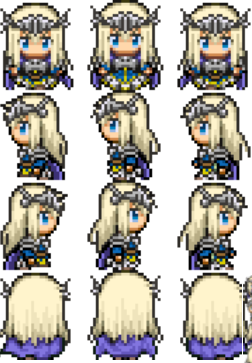

# 美术对接说明(初版)

> 给美术同学看的"照着做"说明,尽量短。有不清楚的直接在群里问。

## 1. 文件命名

一个文件名的格式是:

```
[前缀]_[中文名]_[占位?]_[版本?].png
```

**前缀只有 4 种**,对号入座:

| 前缀 | 含义 | 例子 |
| --- | --- | --- |
| UI | 界面 / 图标 | 开始按钮、血条、物品图标 |
| CHA | 角色 | 主角、敌人 |
| SCE | 场景 | 背景、地图、道具摆设 |
| VFX | 特效 | 受击、爆炸、技能 |

- **中文名**:自己取,能看懂就行,比如「主角待机」「开始按钮」
- **占位**:只有临时凑数用的占位图才加 `_占位`,正式成品**不用加**
- **版本**:第一版不写;改到第二版开始加 `_v2`、`_v3`

示例:

```
UI_开始按钮.png
UI_开始按钮_占位.png
CHA_主角待机.png
CHA_主角待机_占位.png
CHA_主角待机_v2.png
SCE_森林.png
VFX_受击.png
```

## 2. 帧动画怎么给(给整张图)

动画不要一张张给帧,直接给**一整张排好的图**,程序在 Unity 里切割。

- 每个动作一张图,帧按**固定网格**排好:**每帧尺寸一致**,排成几行几列
- 交付时顺带说一句:一行几帧、一共几行(或每帧尺寸),程序照这个切

示例(4 行 × 3 列):



## 3. UI 怎么给(单独一张)

UI 组件**一个一张图,不要拼成一张大图**。

- 每个按钮、血条、图标单独导出,文件名就是组件名
- 程序直接拖进 Unity 用,不用切割、不会分不清谁是谁

```
UI_开始按钮.png
UI_血条.png
UI_金币图标.png
```

## 4. 流程

1. 策划提需求 + 风格参考
2. 你先出**草稿** → 策划确认风格
3. 确认后出**成品** → 上传到 TAPD 对应任务
4. 程序导入 Unity → 给你 **build 预览**
5. 看效果修订,直到满意

## 5. 格式要求(暂定)

- 统一导出 **PNG**,带**透明通道**
- 具体尺寸 / 像素比例,每个任务开始前会在 TAPD 里写明
