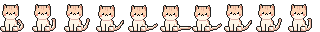
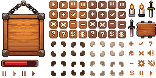
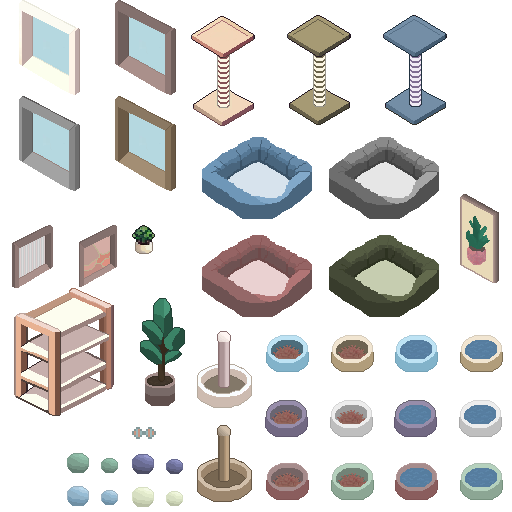

# 美术对接说明(初版)

> 给美术同学看的"照着做"说明,尽量短。有不清楚的直接在群里问。

## 1. 文件命名

一个文件名的格式是:

```
[前缀]_[中文名]_[占位?]_[版本?].png
```

**前缀只有 4 种**,对号入座:

| 前缀 | 含义 | 例子 |
| --- | --- | --- |
| UI | 界面 / 图标 | 按钮、血条、图标 |
| CHA | 角色 | 主角、敌人 |
| SCE | 场景 | 背景、地图、道具摆设 |
| VFX | 特效 | 受击、爆炸、技能 |

- **中文名**:自己取,能看懂就行,比如「主角待机」「开始按钮」
- **占位**:只有临时凑数用的占位图才加 `_占位`,正式成品**不用加**
- **版本**:第一版不写;改到第二版开始加 `_v2`、`_v3`

示例:

```
UI_主界面.png
UI_主界面_占位.png
CHA_主角待机.png
CHA_主角待机_v2.png
SCE_森林.png
VFX_受击.png
```

## 2. 帧动画怎么给(给整张图)

动画不要一张张给帧,直接给**一整张排好的图**,程序在 Unity 里切割。

- 每个动作一张图,帧按**固定网格**排好:**每帧尺寸一致**
- 交付时顺带说一句:一行几帧、一共几行(或每帧尺寸),程序照这个切

常见的两种排法:

**一行帧**(一个动作的帧排成一行):



**多行网格**(多视角 / 多动作,4 行 × 3 列):


## 3. UI 怎么给(整图 + 示例图)

UI 通常一套合并成一张大图,另外再给一张拼好的示例图。

- **素材整图**:所有元素放一张图里,程序切割
- **示例图**:元素拼成完整界面的样子,程序照着它在游戏里还原(切片对不上名字时,靠这张图认)

```
UI_主界面.png          ← 素材整图
UI_主界面_示例.png      ← 拼好的完整界面
```

素材整图示例(所有界面元素放一张图):



少数单独的小元素(通用图标等)才单独给一张。

## 4. 场景 / 道具怎么给(整图)

场景元素(家具、道具、装饰)同样合并成一张大图,程序切割后摆进场景。



## 5. 流程

1. 策划提需求 + 风格参考
2. 你先出**草稿** → 策划确认风格
3. 确认后出**成品** → 上传到 TAPD 对应任务
4. 程序导入 Unity → 给你 **build 预览**
5. 看效果修订,直到满意

## 6. 格式要求(暂定)

- 统一导出 **PNG**,带**透明通道**
- 具体尺寸 / 像素比例,每个任务开始前会在 TAPD 里写明

## 7. 怎么看素材实际效果(可选)

想实时看素材在游戏里的样子,自己拉工程跑(仓库公开、只读):

1. 装 **Unity 6000.3.5f2**(版本要一致)
2. 用 **GitHub Desktop** 克隆 `https://github.com/KaWaIiMT/taptap-spotlight-2026`
3. Unity 打开工程,点 **Play** 跑起来
4. 本地随便改、随便试,**不会影响别人**(只读,推不上去)

正式素材仍走 TAPD 交付,程序入库;这个工程只用来预览。
